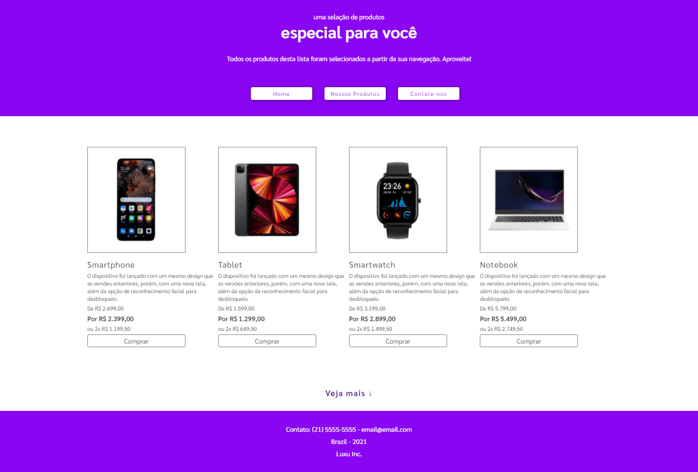
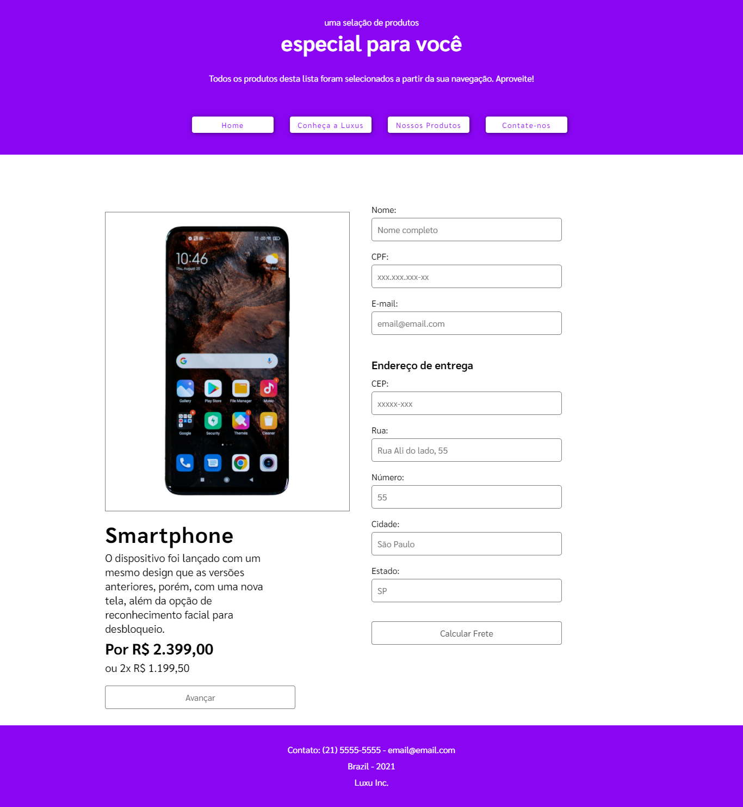

	<h2>Ferramentas Utilizadas:</h2>
	<ul style="font-family: Arial">
		<li> HTML</li>
		<li> CSS </li>
		<li> JavaScript </li>
		<li> Usei o localStorage para salvar informações e recuperá-las para utilizá-las em outras partes do projeto </li>
		<li> Um pouco de Jquery </li>
	</ul>

